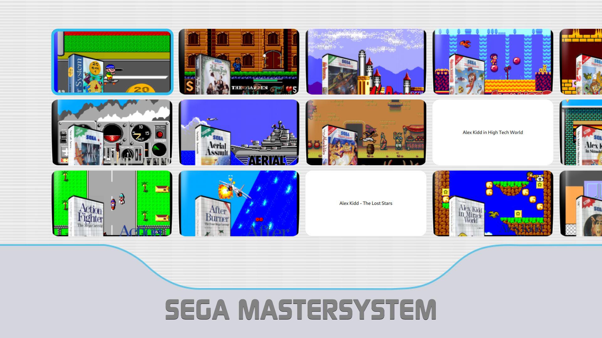

# Revolution Menu

---

This theme seeks to resemble the Wii Menu as much as possible.

Revolution Menu is a theme for [Pegasus Frontend](http://pegasus-frontend.org/).

---

#### Things to do

- [ ] Make the "game window" with "Rev. Menu" and "Start" buttons.

- [ ] Fix part of the code.

- [ ] Add videoplayback when game is hightlighted.

- [ ] Add Options Menu.

- [ ] Make the switch between collections by pages.

---

So guys, I'm not a programmer and I made this theme because I really wanted to have wiimenu as a frontend and I couldn't find it anywhere.

That said, feel free to modify the code and help me or even fork. 

What I'm bringing here is everything I know how to do so far, I'll keep studying and we'll see how far it goes!
